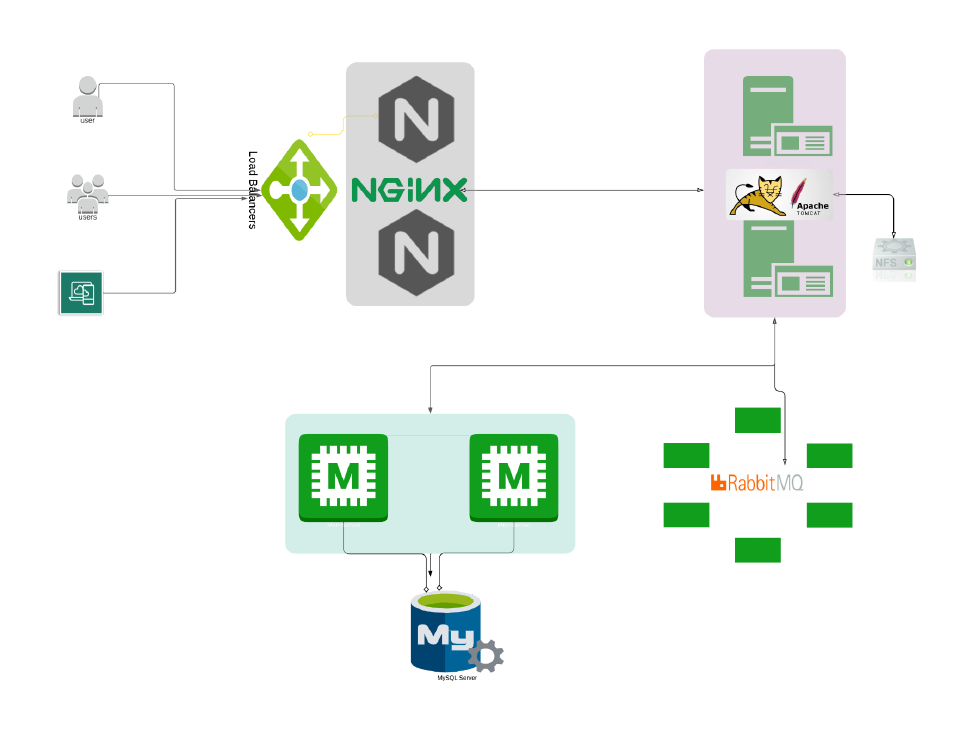

# 🌐 NGINX-Based Scalable System Architecture
This project demonstrates a scalable web system architecture leveraging NGINX as a reverse proxy and load balancer, backed by Apache Tomcat for application hosting, RabbitMQ for asynchronous messaging, and MySQL for persistent data storage.

## 🧱 System Architecture Diagram



## ⚙️ Components Overview

| Component        | Description |
|------------------|-------------|
| **Users**        | External clients interacting with the application. |
| **Load Balancer**| Distributes incoming traffic to NGINX servers for redundancy and performance. |
| **NGINX**        | Acts as a reverse proxy and load balancer, routing requests to the backend application. |
| **Tomcat (Apache)** | Hosts the core web application logic and interfaces `Appication Server`. |
| **RabbitMQ**     | Message broker enabling asynchronous communication between services. |
|**Memcache**| Responsible for Database Caching. |
|**ElasticSearch**| Indexing/Search service. |
| **MySQL**        | Relational database for data persistence. |
| **NFS** (Optional)| Shared file system for web application assets or logs (if applicable). |


---

## 🚦 Traffic Flow

1. Users send HTTP requests to the Load Balancer.
2. Requests are routed to one of the NGINX servers.
3. NGINX proxies the requests to the Apache Tomcat application servers.
4. Application logic may interact with:
   - RabbitMQ for asynchronous jobs
   - MySQL for data storage
   - NFS (optional) for shared file operations

---

## 📦 Tech Stack / Provisioning

- **NGINX**
- **Apache Tomcat**
- **Memcache**
- **RabbitMQ**
- **ElasticSearch**
- **MySQL**
- **NFS (optional)**
- **Linux (1-Ubuntu-based and 4-CentOS-based deployment) `Vagrant file`**

---

## 🚀 Use Cases

- High availability and load-balanced web platforms
- Message-driven architecture for scalability
- Decoupled frontend/backend services using RabbitMQ
- Secure and efficient reverse proxy setup

---

## 🛠️ Setup Instructions
> ##Setup and Provisioning should be done in the order as seen below:  
>1. **MySQL** – Database service  
>2. **Memcache** - DB Caching
>3. **RabbitMQ** – Messaging broker/Queque 
>4. **Apache Tomcat** – Web application 
>5. **NGINX** – Reverse proxy/load balancer
> 

> ##1. MYSQL Setup
>##Login to the db vm
> ```shell
>vagrant ssh db01
```


```bash
# Sample: Start RabbitMQ in Docker
docker run -d --hostname rabbit --name rabbitmq -p 5672:5672 -p 15672:15672 rabbitmq:management
```
```shell
# Sample: Start MySQL
docker run -d --name mysql -e MYSQL_ROOT_PASSWORD=root -p 3306:3306 mysql:5.7
```
